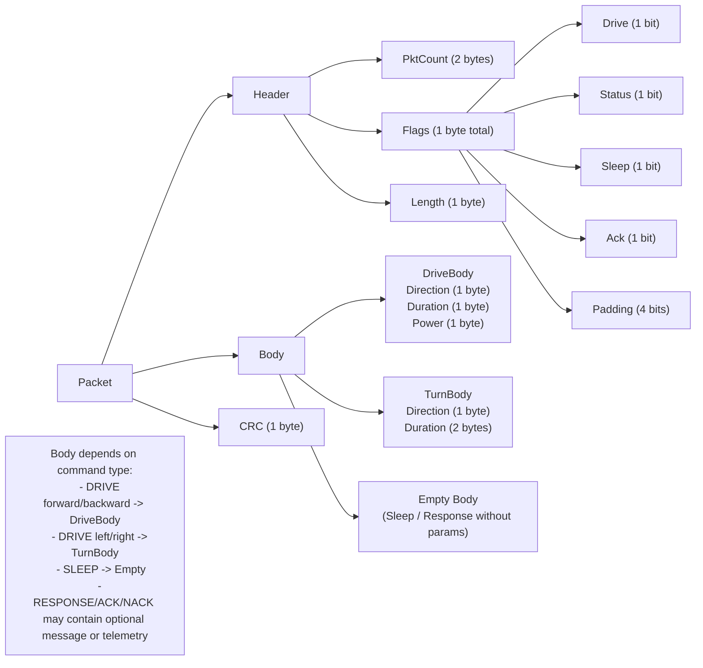
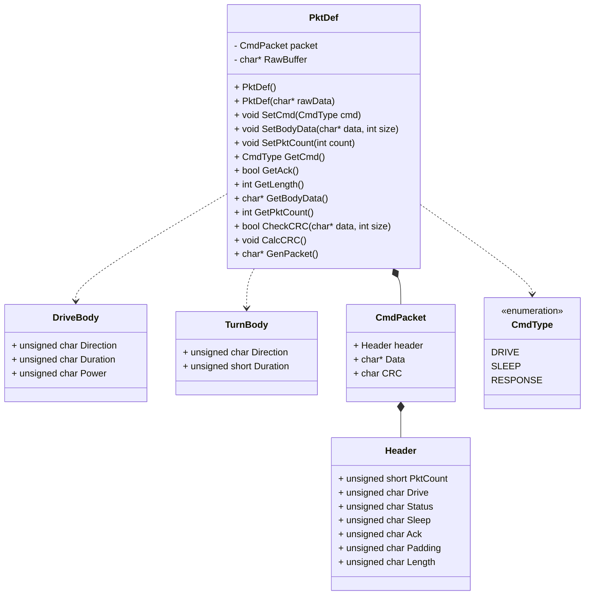
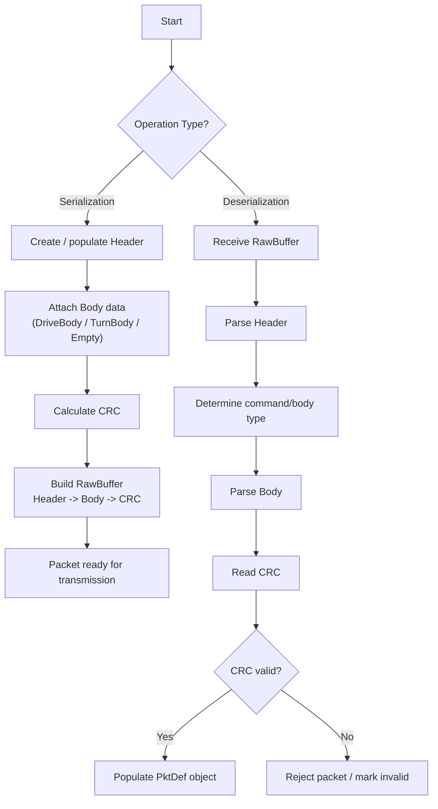
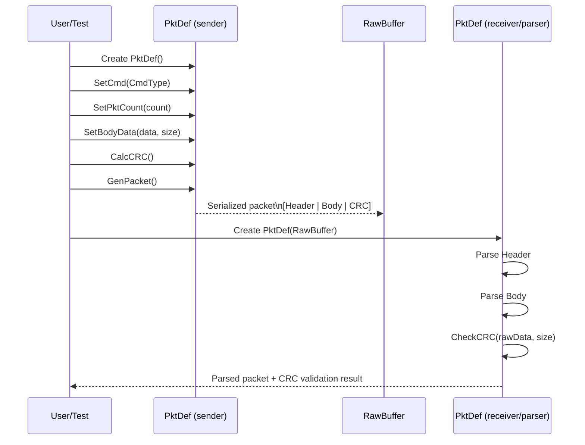

This document contains all diagrams related to the design and implementation of the `PktDef` class and the robot communication protocol.
These diagrams support the understanding of packet structure, system behavior, and data flow.

---

#1. Packet Structure Diagram

---

#2. PktDef Class Diagram

---

#3. Serialization / Deserialization Flow Diagram

---

#4. Sequence Diagram (Build → Serialize → Parse)

-----

## 📌 Notes

- Diagrams are intentionally simplified for clarity
- They directly support Milestone 1 implementation
- All diagrams are created using Mermaid syntax
