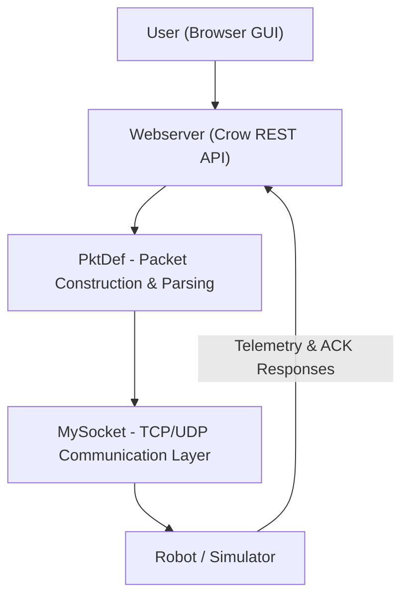

# COIL Robot Command & Control (Milestones 1–3)

Visual Studio C++ solution that implements the robot packet protocol (`PktDef`), a Winsock socket layer (`MySocket`), and a **Crow** REST webserver with a browser GUI. The webserver talks to the robot/simulator over **MySocket** using serialized `PktDef` packets.

---

## Solution layout

Open **`CoilProjectGroup6.sln`** in Visual Studio 2022 (or newer with MSVC v143).

| Project | Type | Role |
|--------|------|------|+
| **PktDefLib** | Static library | Protocol: `PktDef`, headers, bodies, CRC, serialization |
| **PktDefTests** | MSTest DLL | Unit tests for `PktDef` |
| **mysocketlib** | Static library | TCP/UDP client & server: `MySocket` |
| **mysocketTests** | MSTest DLL | Unit tests for `MySocket` |
| **webserver** | Console app | Crow HTTP server on port **8080**; links **PktDefLib** and **mysocketlib** |

Source highlights:

- `PktDefLib/` — `PktDef.h`, `PktDef.cpp`
- `mysocketlib/` — `MySocket.h`, `mysocketlib.cpp`
- `webserver/main.cpp` — REST routes and robot I/O
- `webserver/static/index.html` — browser GUI
- `webserver/crow_lib/include/crow.h` — thin include that pulls in repo-root **`crow_all.h`** (single-header Crow)
- `crow_all.h` — Crow amalgamated header (repo root)
- `docs/project.md` — implementation / audit checklist derived from course documents (not a substitute for official PDFs)

---

##  System Architecture


---

## Overview

The system follows a layered architecture for remotely controlling a robot over a network.
1. The browser GUI allows users to send commands such as drive and sleep.
2. The webserver handles HTTP requests and exposes REST endpoints.
3. The PktDef module constructs and parses packets based on the defined application layer protocol.
4. The MySocket layer manages communication using TCP or UDP.
5. The robot/simulator executes commands and returns acknowledgments (ACK/NACK) or telemetry data.

---

## Prerequisites

1. **Visual Studio** with **Desktop development with C++** and Windows 10/11 SDK.
2. **Standalone Asio** headers on your machine. Crow expects `#include <asio.hpp>`.
3. The **webserver** project sets `AdditionalIncludeDirectories` to Asio include paths. The checked-in paths are machine-specific; **update them in `webserver/webserver.vcxproj`** to point at your Asio `include` folder (or add a shared property sheet / environment variable and reference it there).

Example Asio layout: `.../asio-x.y.z/include/asio.hpp`.

4. **Crow** is provided via **`crow_all.h`** at the solution root. The shim `webserver/crow_lib/include/crow.h` includes it with a relative path—keep that layout if you move files.

---

## Build

1. Open `CoilProjectGroup6.sln`.
2. Set **Configuration** to **Debug** or **Release** and **Platform** to **x64** (recommended).
3. Fix **Asio** include directories in `webserver/webserver.vcxproj` if the compiler reports `asio.hpp` not found.
4. Build **webserver** (right-click → Build). Dependencies **PktDefLib** and **mysocketlib** build automatically.

Set **webserver** as the startup project to run from Visual Studio.

---

## Run the webserver

1. Start **webserver** (F5 or Ctrl+F5).
2. Open a browser: **`http://localhost:8080/`**  
   The root route serves `webserver/static/index.html` (it tries several relative paths so it works from common working directories).

Default Crow listen address is **`0.0.0.0:8080`** (all interfaces).

---

## Connect to the robot / simulator

**POST** `/connect/<robot-ip>/<port>`

Only these ports are accepted (transport is chosen automatically):

| Port | Transport | Typical use |
|------|-----------|-------------|
| **29500** | **UDP** | Robot/simulator UDP command channel |
| **29000** | **TCP** | Alternate TCP endpoint (e.g. some lab setups) |

Any other port returns an error JSON payload.

After a successful connect, the GUI shows “Connected” and internal packet counters reset.

---

## REST API (required routes)

| Method | Path | Purpose |
|--------|------|---------|
| GET | `/` | Serve Command & Control GUI (HTML/JS) |
| POST | `/connect/<string>/<int>` | Configure robot IP/port (see port table above) |
| PUT | `/telecommand/` | JSON body: `drive` or `sleep` (see below) |
| GET | `/telementry_request/` | Housekeeping telemetry request (spelling matches spec) |
| POST | `/routing_table/` | Enable/disable routing to another GUI instance (see below) |

Extra helper (not a course rename): **GET** `/log` — JSON array of recent server log lines (TX/RX and routing).

### `PUT /telecommand/` JSON

- **Sleep:** `{ "command": "sleep" }`
- **Drive forward/back:** `{ "command": "drive", "direction": 1|2, "duration": 0-255, "power": 80-100 }`  
  (`1` = forward, `2` = backward per `PktDef` direction constants.)
- **Turn left/right:** `{ "command": "drive", "direction": 3|4, "duration": 0-65535 }`  
  (`3` = right, `4` = left.) Power is implicit for turns in the protocol.

Successful responses are JSON and typically include:

- `ack`, `flags`, `length`, `message` (when the robot returns a text body)
- `pktCount` / `txPktCount` — outbound sequence from this GUI since last connect
- `rxPktCount` — `PktCount` field parsed from the **robot’s** response header
- `telemetry` — present only when the response looks like a telemetry payload (status + telemetry-sized body)

---

## Routing to another GUI instance

When you need the middle instance to **forward** commands/telemetry to another copy of this webserver (same REST API on another host/port):

1. **POST** `/routing_table/` with JSON:

   **Enable routing**

   ```json
   { "mode": "route", "targetIp": "192.168.1.50", "targetPort": 8080 }
   ```

   **Disable routing (talk to robot directly again)**

   ```json
   { "mode": "direct" }
   ```

2. With routing enabled, **`PUT /telecommand/`** and **`GET /telementry_request/`** are forwarded over **HTTP/TCP** to `http://targetIp:targetPort` (same paths and methods). The target instance must be running and reachable.

The browser GUI includes a **Routing** panel (target IP/port, Enable Routing, Direct Robot) that calls `/routing_table/`.

---

## Browser GUI

`webserver/static/index.html` provides:

- Robot IP and port, **Connect**
- **Routing** target and enable/disable
- **Request Telemetry**
- Drive pad (forward/back/left/right), duration, power (for forward/back), **Sleep**
- Last JSON response and a rolling **Packet Log** (polls `/log`)

---

## Unit tests (MSTest)

- **PktDefTests** — build and run tests from Test Explorer (covers serialization, CRC, classification, ACK/NACK, telemetry shapes, etc.).
- **mysocketTests** — TCP/UDP loopback send/receive and setter guards.

---

## Protocol & libraries (summary)

- **Packet format:** 2-byte `PktCount`, 1-byte flags, 1-byte `Length`, variable body, 1-byte bit-count CRC. See `PktDefLib/PktDef.h` and `docs/project.md`.
- **MySocket:** `CLIENT`/`SERVER`, `TCP`/`UDP`, `SendData` / `GetData`, optional `ConnectTCP()` for TCP clients. See `mysocketlib/MySocket.h`.
- **Crow:** REST server and JSON responses in `webserver/main.cpp`.

---

## Course submission notes

- Official milestones may ask for **`README.txt`** and a clean tree without `Debug`/`Release`/`.vs`. This repository uses **`README.md`** for developer documentation; copy or rename if your rubric requires `.txt`.
- Demo video and Docker/VM deployment evidence are **process/delivery** items—confirm against your current course handouts.

---

## Limitations (known)

- **MySocket** uses blocking calls and receive timeouts in some paths; large HTTP responses during routing may be truncated if they exceed the internal read buffer (typical JSON responses are fine).
- **Asio** paths in `webserver.vcxproj` are **developer-specific** until you point them at your install.
- Ambiguities between course PDFs and this repo are called out in **`docs/project.md`**; when in doubt, follow the **official** milestone documents.
