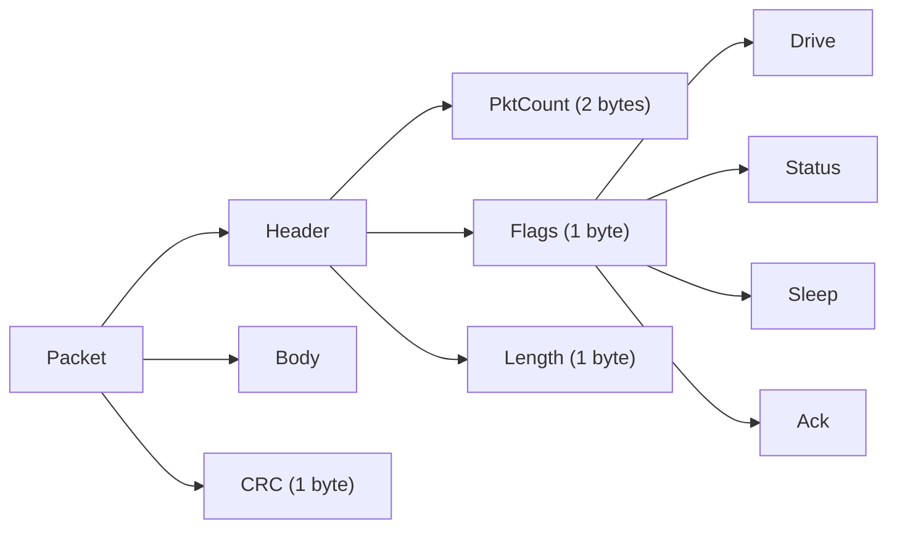
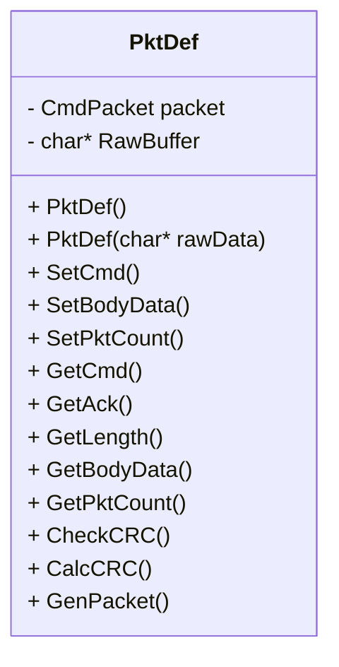
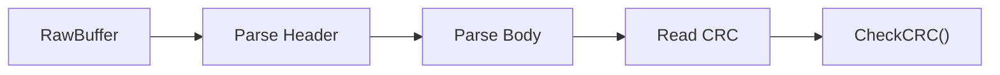

# PktDef Class – Milestone 1

## Overview
This project implements the `PktDef` class for a robot communication protocol.  
It supports:
- Packet construction (serialization)
- Packet parsing (deserialization)
- CRC-based integrity validation

The implementation follows the specified packet format and supports end-to-end data flow.

---

## Packet Structure



## Packet Components

### Header (4 bytes)
- **PktCount** – sequence number  
- **Flags** – command bits (Drive, Status, Sleep, Ack)  
- **Length** – total packet size  

### Body (variable)
- **DriveBody**
  - Direction
  - Duration
  - Power  
- **TurnBody**
  - Direction
  - Duration  
- **Empty**
  - Used for Sleep or simple Response  

### CRC (1 byte)
- Bit-count of all bytes (excluding CRC)  
- Used for integrity validation

## Class design


## Core Functionality
### Serialization (Build Packet)


Steps:

- Set command (SetCmd)
- Set packet count (SetPktCount)
- Set body (SetBodyData)
- Compute CRC (CalcCRC)
- Generate raw packet (GenPacket)

### Deserialization (Parse Packet)


Steps:

- Read header fields
- Extract body
- Read CRC
- Validate integrity

## Key Features (Rubric Alignment)
### Correctness
- Full implementation of packet format (Header + Body + CRC)
- Supports all required commands: DRIVE, SLEEP, RESPONSE
- Accurate CRC calculation and validation
### Design & Structure
- Clear separation of:
- Structured data (CmdPacket)
- Serialized data (RawBuffer)
- Modular function design
### Memory Management
- Dynamic allocation for body and raw buffer
- Proper cleanup in destructor
### Bit Manipulation
- Flags stored in a single byte using bit masks
- Explicit control over byte-level serialization
### Reusability
- Flexible body handling using char*
- Supports multiple packet types
## Example Usage
### Build Packet
```cpp
 PktDef pkt;
 pkt.SetPktCount(1);
 pkt.SetCmd(DRIVE);

char body[3] = {1, 5, 80};
pkt.SetBodyData(body, 3);

char* raw = pkt.GenPacket();
```

### Parse Packet
```cpp
PktDef parsed(raw);

if (parsed.CheckCRC(raw, parsed.GetLength()))
{
    // valid packet
}
```

## Limitations
- Parsing assumes valid input buffer
- GetCmd() defaults to RESPONSE if no command bits are set
- CRC uses simplified bit-count method

## Conclusion

The PktDef class satisfies Milestone 1 requirements by providing:

- Packet creation
- Packet parsing
- Data integrity validation
