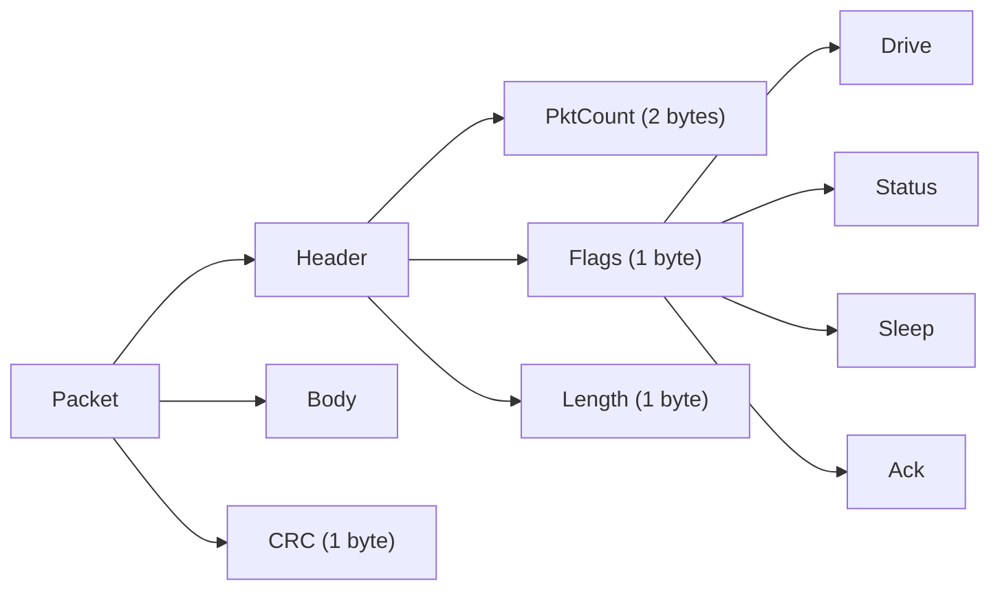
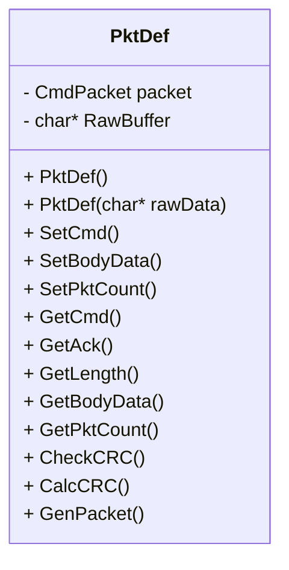
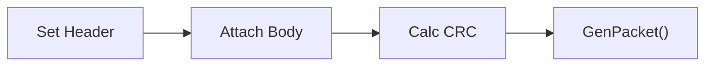
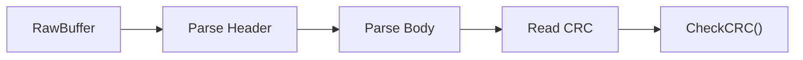
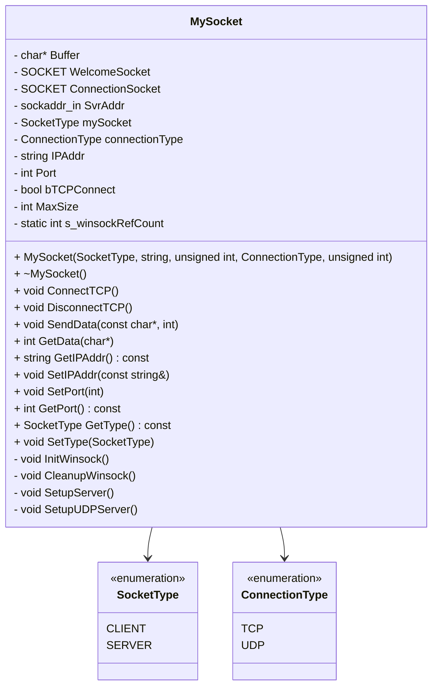

# PktDef Class – Milestone 1

## Overview
This project implements the `PktDef` class for a robot communication protocol.  
It supports:
- Packet construction (serialization)
- Packet parsing (deserialization)
- CRC-based integrity validation

The implementation follows the specified packet format and supports end-to-end data flow.

---

## Packet Structure



## Packet Components

### Header (4 bytes)
- **PktCount** – sequence number  
- **Flags** – command bits (Drive, Status, Sleep, Ack)  
- **Length** – total packet size  

### Body (variable)
- **DriveBody**
  - Direction
  - Duration
  - Power  
- **TurnBody**
  - Direction
  - Duration  
- **Empty**
  - Used for Sleep or simple Response  

### CRC (1 byte)
- Bit-count of all bytes (excluding CRC)  
- Used for integrity validation

## Class design


## Core Functionality
### Serialization (Build Packet)


Steps:

- Set command (SetCmd)
- Set packet count (SetPktCount)
- Set body (SetBodyData)
- Compute CRC (CalcCRC)
- Generate raw packet (GenPacket)

### Deserialization (Parse Packet)


Steps:

- Read header fields
- Extract body
- Read CRC
- Validate integrity

## Key Features (Rubric Alignment)
### Correctness
- Full implementation of packet format (Header + Body + CRC)
- Supports all required commands: DRIVE, SLEEP, RESPONSE
- Accurate CRC calculation and validation
### Design & Structure
- Clear separation of:
- Structured data (CmdPacket)
- Serialized data (RawBuffer)
- Modular function design
### Memory Management
- Dynamic allocation for body and raw buffer
- Proper cleanup in destructor
### Bit Manipulation
- Flags stored in a single byte using bit masks
- Explicit control over byte-level serialization
### Reusability
- Flexible body handling using char*
- Supports multiple packet types
## Example Usage
### Build Packet
```cpp
 PktDef pkt;
 pkt.SetPktCount(1);
 pkt.SetCmd(DRIVE);

char body[3] = {1, 5, 80};
pkt.SetBodyData(body, 3);

char* raw = pkt.GenPacket();
```

### Parse Packet
```cpp
PktDef parsed(raw);

if (parsed.CheckCRC(raw, parsed.GetLength()))
{
    // valid packet
}
```

## Limitations
- Parsing assumes valid input buffer
- GetCmd() defaults to RESPONSE if no command bits are set
- CRC uses simplified bit-count method

## Conclusion

The PktDef class satisfies Milestone 1 requirements by providing:

- Packet creation
- Packet parsing
- Data integrity validation

# MySocket Library (Milestone 2)
## Overview
The MySocket class provides a minimal but functional abstraction layer for TCP and UDP communication using Winsock on Windows. It supports both client and server roles and is designed to send and receive raw byte streams for robot‑control applications in later milestones.

This implementation focuses on correctness, clarity, and expandability while keeping the code simple enough for Milestone 2 requirements.

## Design Goals
- Encapsulate Winsock initialization and cleanup
- Provide a unified interface for TCP and UDP
- Support both client and server modes
- Dynamically allocate a raw buffer for incoming data
- Enforce safe state transitions (e.g., prevent IP changes after connection)
- Keep implementation blocking and single‑threaded for simplicity
- Provide a clean foundation for future milestones (PktDef integration, telemetry, etc.)

## Class Overview
The MySocket class is configured using two enums:

```cpp
enum SocketType { CLIENT, SERVER };
enum ConnectionType { TCP, UDP };
```
This allows four operating modes:

|SocketType	| ConnectionType	|Behavior|
|-----------|-------------------|--------|
|CLIENT|	TCP|	Connects to server via 3‑way handshake|
|SERVER|	TCP|	Binds, listens, accepts|
|CLIENT|	UDP|	Sends datagrams (no bind)|
|SERVER|	UDP|	Binds and receives datagrams|

## UML Class Diagram


## Member Data Explanation
### Buffer & Size
- char* Buffer	Stores incoming raw data
- int MaxSize	Maximum buffer capacity

### Socket Handles
- SOCKET WelcomeSocket	TCP server listening socket
- SOCKET ConnectionSocket	Active communication socket

### Addressing
- sockaddr_in SvrAddr	IP/Port in Winsock format
- std::string IPAddr	Human‑readable IP
- int Port	Port number

### Configuration
- SocketType mySocket	CLIENT or SERVER
- ConnectionType connectionType	TCP or UDP
- bool bTCPConnect	Tracks TCP client connection state

### Winsock Lifecycle
- static int s_winsockRefCount	Ensures WSAStartup/WSACleanup are balanced

## TCP Methods
**ConnectTCP()**
- Only valid for TCP clients
- Creates socket
- Calls connect()
- Sets bTCPConnect = true

**DisconnectTCP()**
- Shuts down and closes TCP connection
- Resets connection state

## Data Transmission
** SendData(const char*, int) **
- TCP Server: accepts connection if needed, then sends
- TCP Client: sends only after successful ConnectTCP()
- UDP: sends datagram via sendto()

** GetData(char*) **
- TCP Server: accepts connection if needed, then receives
- TCP Client: receives from server
- UDP Server: receives datagram via recvfrom()
- Copies data into caller’s buffer
- Returns number of bytes received

## Getters & Setters
- GetIPAddr()	Returns configured IP
- SetIPAddr()	Allowed only before TCP connection
- SetPort()	Same restriction as IP
- GetPort()	Returns port
- GetType()	Returns CLIENT/SERVER
- SetType()	Forbidden if TCP server is listening or client is connected

## Testing Summary
A single MSTest file contains multiple test classes covering:
- Constructor behavior
- TCP client/server connection
- TCP send/receive
- UDP send/receive
- Getter/setter restrictions
Tests use loopback networking (127.0.0.1) and small sleeps to avoid race conditions.

## Known Limitations 
- Blocking sockets
- No threading
- No timeouts
- No packet framing (PktDef integration comes later)
- Minimal error reporting

These are items we are working on
